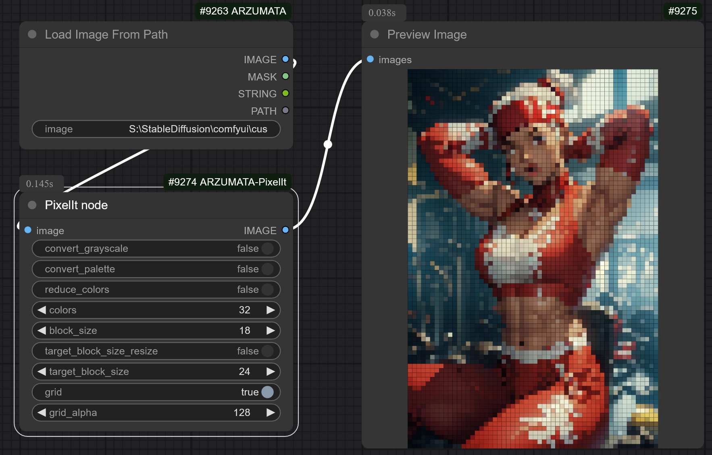

# ComfyUI-ARZUMATA-PixelIt
A python port of [pixelit](https://github.com/giventofly/pixelit) by [giventofly](https://github.com/giventofly)

This node allows users to pixelate images using various parameters such as block size, color reduction, and grid overlay.
Added some extra features for my needs for ComfyUI.

## Installation

Clone this repository to `ComfyUI/custom_nodes` directory.

```bash
git clone https://github.com/your-repo-url.git
```
## Preview

### Preview
<details>
  <summary>Preview</summary>



</details>

## Usage

To use the PixelIt node in ComfyUI:

1. **Open ComfyUI:**
Launch the ComfyUI application.

2. **Access the Node:**
In the node palette, search for "PixelIt" to locate the custom node.

3. **Configure Parameters:**

 - `image`: The input image that you want to pixelate.
 - `convert_grayscale`: If checked, converts the image to grayscale before pixelation.
 - `convert_palette`: If checked, converts the image to a color palette.
 - `reduce_colors`: If checked, reduces the number of colors in the image.
 - `colors`: The target number of colors for the reduced-color option (range: 1-256).
 - `block_size`: The size of each pixel block (range: 1-256).
 - `target_block_size_resize`: If checked, resizes the image based on the target block size.
 - `target_block_size`: The target block size for resizing (range: 1-256).
 - `grid`: If checked, overlays a grid over the pixelated image.
 - `grid_alpha`: The alpha transparency of the grid overlay (range: 0-255).

4. **Execute the Node:**
Connect the PixelIt node to your workflow and run it to generate the pixelated output.

## Example Workflow

1. Load an image using the `ImageLoader` node.
2. Connect the output from the `ImageLoader` node to the `PixelIt` node.
3. Configure the parameters as desired.
4. Add any additional nodes to process or save the output, such as a `ImageSaver`.

## Credit
giventofly/[pixelit](https://github.com/giventofly/pixelit) - inspired by.

**And, for all ComfyUI custom node developers**


